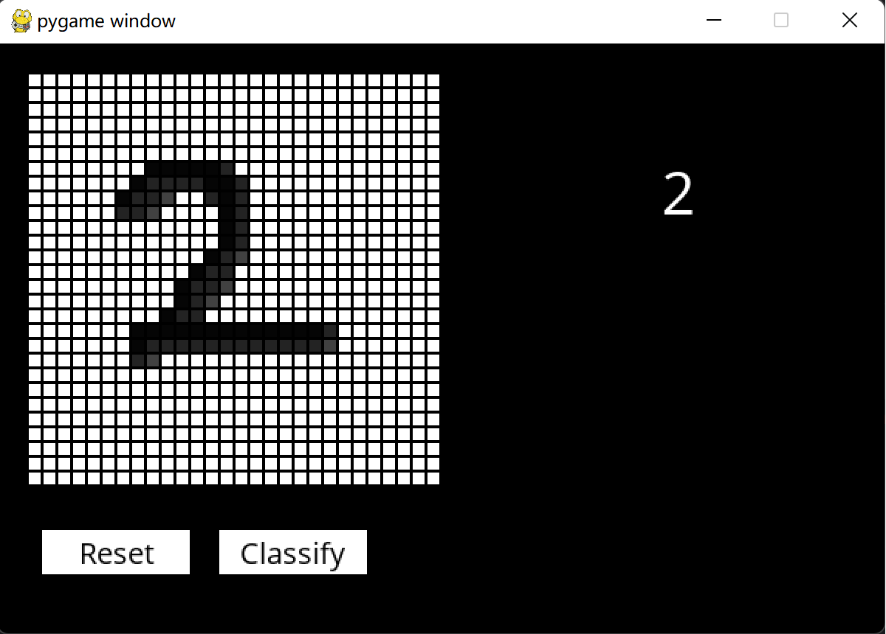
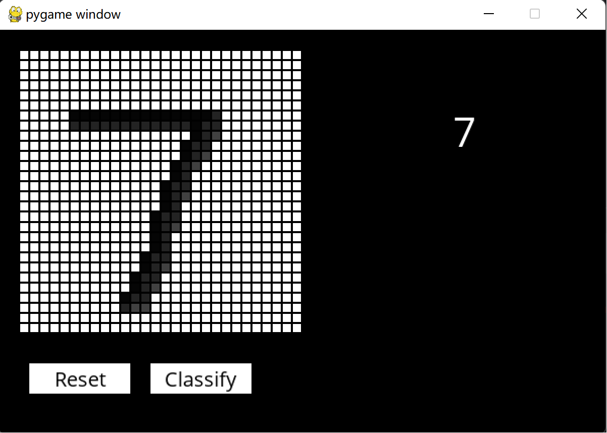

# 手写数字识别  
## 使用说明:  
文件路径中最好不要包含中文名!  
1. `handwriting.py`使用tensorflow框架实现数字识别

运行训练模型并且不保存模型参数
```
python handwriting.py
```
运行训练模型并且要保存模型参数,第二个参数表示模型保存在`model.h5`文件中
```
python handwriting.py model.h5
```

2. 'recognition.py' 使用pygame模块实现自建手写数字识别验证, 第二个参数表示使用`model.h5`中的模型
```
python recognition.py model.h5
```

3. `model.h5`保存的训练模型  
4. `OpenSans-Regular.tff`字体文件,用于`recognition.py`的字体加载
---
## 自建手写数字验证 
**手写数字2识别**
 

**手写数字7识别**

